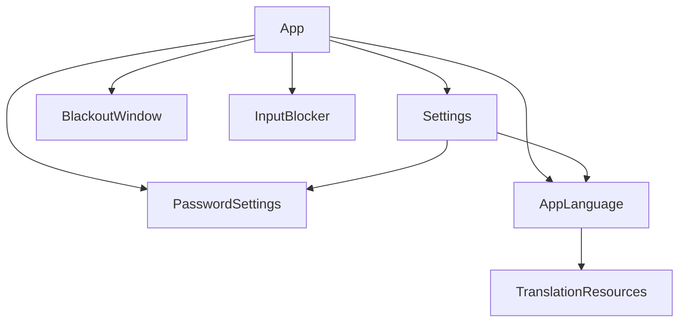

# Architecture

BlackoutMac is a small native AppKit executable. It uses Apple frameworks and has no third-party runtime dependencies. The folder boundaries keep independent responsibilities separate without introducing wrapper interfaces or a package per class.

```text
Sources/
  App/                         Entry point and lifecycle orchestration
  Core/
    Localization/              Language preferences and bundle lookup
    Security/                  Password verifier and stored settings
  Platform/Input/              macOS event-tap lifecycle and routing
  Features/
    Blackout/                  Native blackout window
    Settings/                  Settings window
Resources/Localization/        App translation bundles
Tests/{Input,Localization,Security}/
scripts/                       Build, install, tests, release, removal
docs/
  ko/                          Korean quick start
  site/                        Multilingual website and user guides
```

Dependencies flow downward:



- **Core** depends on Foundation and native cryptography only. Password storage knows nothing about windows, app startup, or localized UI messages.
- **Platform/Input** depends on native input APIs and Foundation. It reports wake/failure/input-source requests through callbacks and never imports application or settings logic.
- **Features** present native windows using lower-level settings/localization. They do not start the app or own its lifecycle.
- **App** composes the components, owns blackout state, and translates domain errors for presentation. `BlackoutApp` is only the entry point.
- **Resources** contain data. **Documentation** and **packaging scripts** do not participate in runtime dependencies.

The source tree compiles as a single Swift executable. These are source-level boundaries, not separate Swift packages. Tests exercise the lower-level production files directly, without loading the running app.
