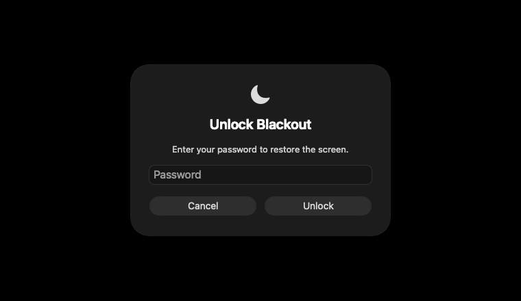

# BlackoutMac

모든 화면을 검게 가리고 입력을 차단하는 macOS 메뉴 막대 앱입니다. 원하면 해제 비밀번호를 설정할 수 있습니다.

**[DMG 다운로드](https://github.com/baba9811/blackout-mac/releases)** · [웹사이트](https://baba9811.github.io/blackout-mac/ko/) · [English](../../README.md)

macOS 13 이상 · Apple Silicon 및 Intel · 32개 언어

> 미리보기 배포본은 **Developer ID 서명과 Apple 공증이 없습니다**. 실행이 차단되면 [설치 도움말](../usage/ko.md#설치)을 확인하세요.

## 빠른 시작

1. [Releases](https://github.com/baba9811/blackout-mac/releases)에서 DMG를 받아 열고 **Blackout.app**을 **Applications**로 드래그합니다.
2. 앱을 열고 메뉴 막대의 **Blackout 아이콘 → 설정… → 입력 차단 → 입력 권한 설정 열기…**를 누른 뒤, 열린 패널에서 Blackout을 허용합니다.
3. **Control + Option + B**를 누르거나 메뉴 막대에서 **지금 화면 가리기**를 선택합니다.
4. 마우스 이동·스크롤·클릭·키 입력으로 돌아옵니다. 비밀번호를 설정했다면 해제창에 입력합니다.

**비상 탈출:** 비밀번호 사용 여부와 관계없이 **Escape를 3초간 누르면** 해제됩니다. [복구 도움말 →](../usage/ko.md#비밀번호와-복구)

Blackout은 화면을 가리는 앱이며, 비밀번호는 일반적인 해제에만 적용됩니다. Mac 세션을 보호하려면 **macOS 화면 잠금(Control + Command + Q)**을 사용하세요. [기능의 한계 →](../usage/ko.md#입력-차단과-보안)

## 미리보기

*현재 앱 소스로 렌더링한 선택형 비밀번호 해제창입니다. 비밀번호는 기본적으로 꺼져 있으며, 화면 언어는 설정에서 바꿀 수 있습니다.*

## 자세한 안내

- [설정·비밀번호 복구·입력 권한](../usage/ko.md)
- [기존 앱 업데이트](../usage/ko.md#업데이트)
- [다국어 사용 설명서](https://baba9811.github.io/blackout-mac/ko/)
- [빌드·검증·삭제](../development.md) · [구조](../architecture.md) · [배포](../distribution.md)

문제 제보와 번역 수정은 어떤 언어로든 환영합니다. [기여 안내](../../.github/CONTRIBUTING.md), [행동 강령](../../.github/CODE_OF_CONDUCT.md), [보안 정책](../../.github/SECURITY.md)을 참고하세요. [MIT 라이선스](../../LICENSE).
